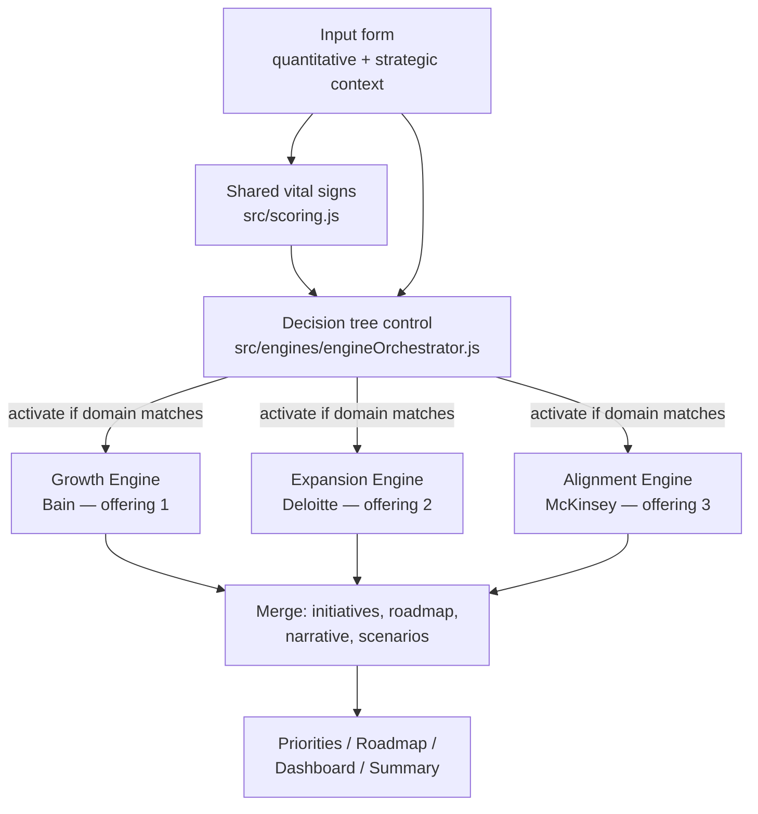

# Architecture — multi-engine diagnostic

Phase 5 is the strategic brain. This document is the source of truth for how engines, the decision tree, and initiative libraries fit together.

## System diagram



An older company losing share, leaking clients, and watching costs rise is **not one archetype**. Typical activation:

| Symptom | Domain | Engine |
|---------|--------|--------|
| Market share / win-rate pressure | `market_share_loss` | Growth |
| Client concentration / churn risk | `client_churn_concentration` | Growth |
| Pricing and margin pressure | `pricing_pressure` | Growth |
| Rising cost-to-serve | `rising_costs` | Alignment |
| BD ↔ Ops strain | `bd_ops_split` | Alignment |
| Leadership cadence gap | `leadership_gap` | Alignment |
| New office or new stream selected | `new_office` / `new_revenue_stream` | Expansion |

## Folder structure (production)

```
src/engines/
  isiEngineKit.js          Shared helpers + createEngine()
  growthEngine.js          Module scoring for offering 1
  expansionEngine.js       Module scoring for offering 2
  alignmentEngine.js       Module scoring for offering 3
  engineOrchestrator.js    Detect → activate → merge

src/data/
  scoringModel.json        Vital-sign weights / thresholds
  decisionControl.json     Engine catalog + domain detectors + scenarios
  engines/growthModel.json
  engines/expansionModel.json
  engines/alignmentModel.json
  diagnosticInput.json     Canonical input keys (template)
  roadmapModel.json        Phase labels (30/60/90/180)
  decisionTree.json        Pointer only (legacy single-tree retired)
  prioritizationModel.json Pointer only (libraries moved into engines)

src/decisionTree.js        Control UI (run + display)
src/prioritization.js      Renders merged initiative list
src/roadmap.js             Renders distinct phased work
src/dashboard.js / summary.js
src/engine/isiDiagnosticEngine.js   sessionStorage accessors
```

Diagnostic HTML loads kit → three engines → orchestrator → page script. Fetch URLs are root-absolute (`/src/data/engines/...`).

## Service domains

### 1. Growth Engine (Bain)

**Offering:** Revenue growth and problem diagnosis.

**Modules:** Growth strategy, market positioning, pricing strategy, sales process maturity, pipeline velocity, customer segmentation, channel strategy, GTM architecture.

**Firm references (used as lineage, not as licensed products):** Bain Full Potential, commercial excellence, Founder’s Mentality, Net Promoter System, Results Delivery; McKinsey pricing waterfall; Deloitte revenue operations / Enterprise Value Map where a leak map is needed.

**Outputs:** Growth score, growth archetype, growth initiatives, growth slice of the roadmap, growth narrative.

**Archetypes (by engine score):** `growth_engine_stalled` (0–50), `constrained_growth` (50–75), `commercial_full_potential` (75+).

### 2. Expansion Engine (Deloitte)

**Offering:** New startups, new offices, new revenue streams.

**Modules:** Market entry, new office launch, new revenue stream design, product/offer strategy, operational scaling, org design, capital allocation, innovation readiness.

**Firm references:** Monitor Deloitte market entry and operating model; McKinsey Three Horizons and core vs adjacency; Bain ring-fenced growth capital / Results Delivery.

**Outputs:** Expansion readiness score, expansion archetype, launch initiatives, Horizon-2 roadmap slice, strategic narrative.

**Archetypes:** `expansion_not_ready`, `expansion_conditional`, `expansion_ready`.

Activates when growth posture is **expand** or expansion intent is new office, new stream, or both.

### 3. Alignment Engine (McKinsey)

**Offering:** Business development + operational excellence alignment.

**Modules:** Cross-functional alignment, leadership capability, execution discipline, operating model, culture and incentives, governance cadence, cost/throughput excellence, capability building.

**Firm references:** McKinsey 7S, Organizational Health (OHI), Influence Model, transformation office, capability building; Deloitte Enterprise Value Map and operating model; Bain Full Potential for cost-to-serve and 13-week cash.

**Outputs:** Alignment score, operating-model archetype, alignment initiatives, execution roadmap slice, leadership narrative.

**Archetypes:** `operating_model_broken`, `alignment_strained`, `aligned_execution`.

## Decision-tree control system

**Control data:** `src/data/decisionControl.json`  
**Runtime:** `src/engines/engineOrchestrator.js` (`ISI.detectDomains`, `ISI.orchestrate`)  
**UI:** `/diagnostic/decisionTree.html` — **Run Multi-Engine Tree**

### Branches

| Branch | Typical signals |
|--------|-----------------|
| Quantitative | Shared ratings (R/Y/G), close rate, concentration, cost-to-serve, sales cycle |
| Qualitative | Commercial maturity, BD–Ops tension, leadership score, bottlenecks |
| Strategic | Growth posture, expansion intent (office / stream / both) |

If nothing matches, **Growth** still runs so the client always gets a commercial diagnosis.

### Stored payload (`isi_decisionTree`)

Backward-compatible fields `id`, `name`, `rootCause` are the **binding** engine (lowest engine score among those activated). Additional fields:

- `activated` — engine ids
- `branches` — quantitative / qualitative / strategic rows
- `engines[]` — per-engine score, modules, archetype, narrative, initiatives, roadmap
- `initiatives` — merged ranked list
- `roadmap` — four phases with **distinct** work
- `scenarios` — stabilize / grow the core / integrated program, with projected vital signs
- `narrative` — client-facing headline, situation, implication, recommendation

Also written on run: `isi_engines`, `isi_prioritization`, `isi_roadmap`.

## Initiative libraries

Libraries live **inside each engine model**, not in one global list.

| File | Count | Horizon field |
|------|-------|----------------|
| `growthModel.json` | 18 | `30` / `60` / `90` / `180` |
| `expansionModel.json` | 15 | same |
| `alignmentModel.json` | 18 | same |
| **Total** | **51** | |

Each initiative includes: `id`, `name`, `firm`, `family`, `summary`, `drivers` (archetype + module + domain ids), `roi`, `effort`, `horizon`, `impacts` (revenue / margin / operations / leadership).

Priority score = `roi * 100 - effort * 50`, plus boosts when drivers match the active archetype or detected domains.

Roadmap assignment: items keep their `horizon`. The orchestrator round-robins up to two items per engine per phase so 30/60/90/180 are not copies of the same two names.

## Shared vital signs (scoring)

`src/data/scoringModel.json` — Green ≥ 75, Yellow ≥ 50, else Red.

| Category | Inputs |
|----------|--------|
| Revenue | pipeline, closeRate, dealSize, salesCycle |
| Margin | gross margin %, EBITDA % |
| Operations | costToServe (inverted), concentration (inverted), salesCapacity |
| Leadership | 1–10 × 10 |

Annual `revenue` and free-text `bottlenecks` are stored for context; they do not enter the four category scores. Strategic selects on the input form feed the **control tree**, not this scorer.

## sessionStorage

| Key | Writer |
|-----|--------|
| `isi_input` | Input (also writes legacy `isi_diagnosticInput`) |
| `isi_scoringResults` | Scoring |
| `isi_decisionTree` | Decision-tree orchestrator |
| `isi_engines` | Same run (per-engine results) |
| `isi_prioritization` | Tree run / Generate Priorities |
| `isi_roadmap` | Tree run / Generate Roadmap |
| `isi_discovery` | Marketing Discovery form (prefill) |

Nothing is posted to a server. Export / CRM / webhook / cloud remain stubs.

## Page load order (diagnostic)

1. `isiHeader.js` → `injectIsiHeader()`
2. `isiNav.js` → `injectIsiNav(step)`
3. `isiConfig.js` then `isiDiagnosticEngine.js`
4. On tree / priorities / roadmap / dashboard / summary: kit, three engines, orchestrator
5. Page JS (`decisionTree.js`, `prioritization.js`, …)
6. `export.js` / `saveShare.js` on roadmap, dashboard, summary
